# Maker Resources 

How to get started with Arduino, Raspberry Pi, simple Circuit Design and 3D printing.

##  Makers and the Hacker Ethic
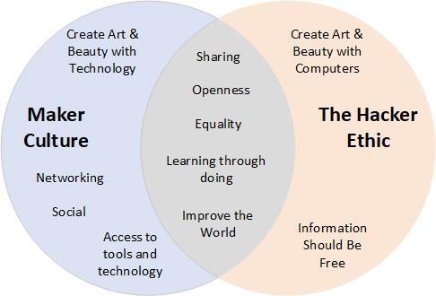

# The Microcomputer Revolution!

## Raspberry Pi

[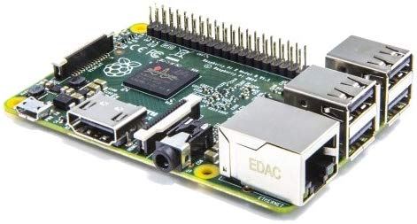](https://www.raspberrypi.org/)

**Advantages**
* Cost: £24 to £50 alone / £60 to £90 for a kit 
* Raw Power!
* Full Linux Operating System - can run Terminal, GUI and/or Headless
* Supports many programming Languages. C++, Java, Python, etc.
* Lots of connectivity: Wi-Fi, LAN, USB, Bluetooth, I2C, SCO, GPIO
* Lots of compatible add-on hardware - Pi Hats.
* Amazing on-line community and support.
* Different models for different needs.

**Disadvantages**
* Current & Power Consumption
* Boot up & shutdown
* Schematics are released but HW is not open source.

## Arduino

[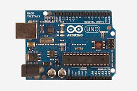](https://www.arduino.cc/) [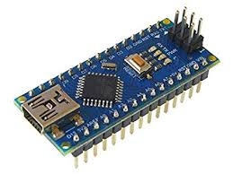](https://www.arduino.cc/)

**Advantages**
* Cost: £3 to £34 alone / £35 to £75 for a kit
* Lots of different models with different capabilities (not all Arduino)
* Low level connectivity: I2C, Serial, SCO, Analogue and Digital GPIO
* Low power - 5V, 3.3V, sleep mode
* Arduino IDE with support for many libraries and board types
* Open source HW - Anyone can download the schematics and build their own!
* Huge community and support
* Sets the standard form factor and Breadboard-able
* Huge array of Arduino Add-on boards and HW Modules

**Disadvantages**
* Connectivity can require add-on modules e.g. for Bluetooth or Wi-Fi
* Very low level - No Operating System
* Only supports C++ Programming
* Base models have limited memory and lower computational power.

## arm mbed

[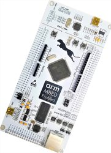](mbed.com/en/) [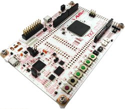](mbed.com/em)

**Advantages**
* Home team - Arm Ltd, a Cambridge based company!
* Cost: £10 for basic boards to £££
* Arm mbed OS for embedded or bare bones (like Arduino)
* On-line IDE and Compilers - or downloadable.
* JTAG for on-board debugging (costs extra).
* Designed for Internet of Things (IoT)

**Disadvantages**
* Smaller community
* More commercially and corporate focused.
* Mainly C++
* HW is not open source, mbed is not open source (many code libraries are though).

## Adafruit Feather

[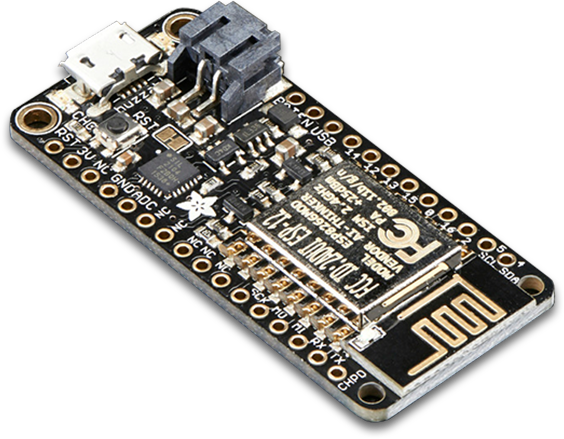](https://www.adafruit.com/)

**Advantages**
* Cost: £18 to £60 for boards or add-ons.
* Own form-factor boards - the Feather - with compatible add-on boards.
* Feathers usually have battery and charging support built in!
* Boards and add-on libraries supported in the Arduino IDE and ecosystem
* Amazing community - how-to videos, tutorials, examples
* Open source software for all their products, available through github
* Circuit Python! - Python for embedded with compatible boards 
* All in one stop for beginers through to seasoned hackers.

**Disadvantages**
* Ordering Adafruit products directly from the US can be expensive (customs costs) but there are Adafruit re-sellers on Amazon and Ebay :)

## Android

**Advantages**
* Android devices are almost ubiquitous - watches, phones, tablets. 
* Connectivity: Wi-Fi, Bluetooth and often Cellular.
* Portable: Every Android device has a battery and a complex UI.
* Android development kit is free and most of the SW is open source
* Good community and support, but more professional developer focused
* Java and C++ support, multiple IDE development platforms (some Python)

**Disadvantages**
* Probably highest cost for HW but cheapest 7" Android tablet on Amazon is only £30
* HW is nearly all closed source.
* Higher learning curve, not so beginner friendly.

## BBC Microbit (honorable mention)

[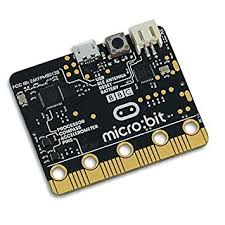](https://microbit.org/)

**Advantages**
* Lowest cost for complete dev kit < £20
* Lots of add-on boards and modules available
* Very easy to programme - Drag and Drop Python to the board.
* Bluetooth for remote programming and communciations
* Lots of IO on the device - LED, accelerometer, Bluetooth, battery charge and support
* Excellent community and support

**Disadvantages**
* Aimed and teaching and learning, so limited capability beyond that focus
* Form Factor is not designed for prototyping / making.

## Fritzing - Open Source CAD for Microcontrollers

[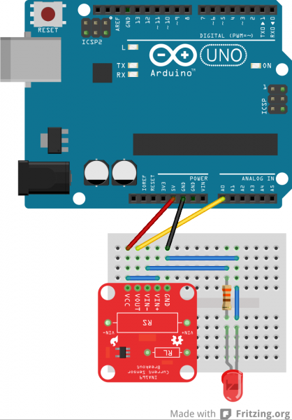](https://www.fritzing.org)

**What is it?**

An open source Computer Aided Design tool specifically aimed at Microcontrollers such as Raspberry Pi and Arduino. You must download and install the app.

**What can it do?**

You can design breadboard circuits for your microcontroller, convert them to schematics, even PCB add-on boards for Arduino or Raspberry Pi

**Is it free?**

There is a small fee of $8 requested for supporting the development, when downloading the application.

# 3D Printing

 [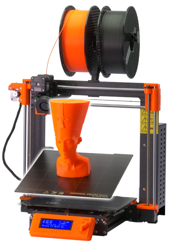](https://prusa3d.com)

**Advantages**
* Great for prototyping, for modelling, for repairing!
* Massive community of support for both 3D modelling and printing
* Most 3D printers are open source HW and there is a lot of 3D modelling and slicing SW that is also open source.
* Lots of support for commercial 3D printers - you don't have to own one!
* 3D modelling software is becoming ubiquitous - Print 3D / 3D Builder in Windows 10!

**Disadvantages**
* Learning curve for both modelling and printing.
* Cost or access to 3D Printer (Cheapest 3D printer on Amazon is £250!)
* Only small form-factor (200cm x 200cm x 200cm)
* Cost of commercial 3D printing can be high depending on project.

**Resource Links**
* [Thingiverse](https://www.thingiverse.com/) - Like youtube but for 3D models.
* [Tinkercad](https://www.tinkercad.com/) - 3D modelling in your browser!
* [Blender](https://www.blender.org/) - 3D modelling, simulation and animation - Open Source!

# Maker Spaces 
## What are they?

These are community work shops and spaces where Makers can come together or use technology such as 3D printers, Laser Cutters, electronics work stations.

They're run by enthusiasts and/or sponsors.

Very inclusive and a great opportunity to learn in a welcoming environment about technologies or tools.

## Cost?

This can vary, but can be quite expensive. Some ask for a membership fee per month. 

However, there is often a steep discount for students and for scheduled events and workshops. 

## Maker Spaces in Cambridge

Location: 16 Mill Lane, Cambridge, CB2 1RX

[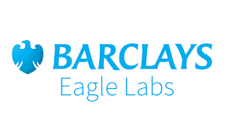](https://labs.uk.barclays/locations/cambridge-cherry-hinton) 

Location: 7-8 Clifton Court, Cherry Hinton Road, Cambridge, CB1 7BN

# More resources for Hackers and Makers

| Who                  | Where                      | What                     |
|:--------------------:|:--------------------------:|:-------------------------|
|  | https://www.hackaday.com | Hardware and Software projects. Fresh hacks every day!|
| | https://www.makezine.com | Maker projects of all kinds |
| | https://arduino.stackexchange.com/ | Q&A Board for Arduino | 
| | https://electronics.stackexchange.com/ | Q&A Board for Electronics |
| | https://github.com/ | Open Source : Software Configuration  & Project Management
